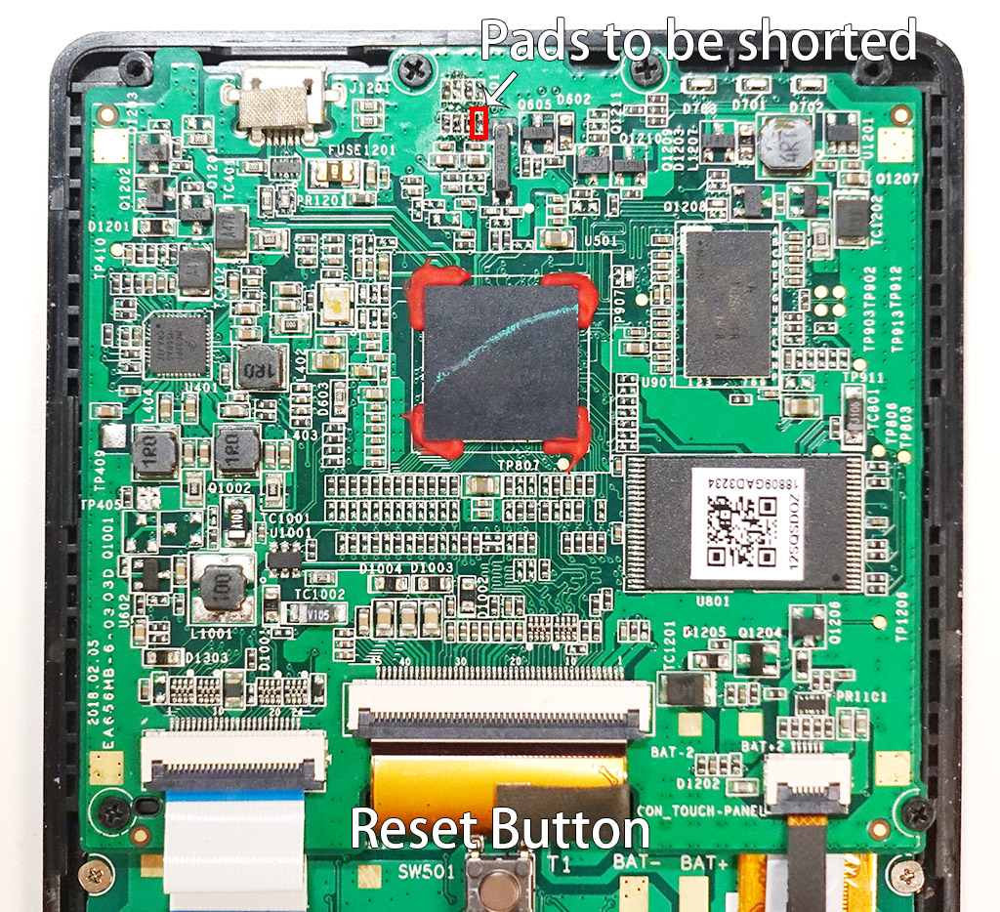

# HP Prime Linux

# 0. Overview

This project aims to port Linux to the HP Prime calculator, based on the Buildroot distribution. The long term goal of this project is to provide an alternative OS that is more capable than the original OS (PPL support, or better RPN support, native binary code execution, etc).

Please be aware this project is still in its early stages. It is not useful for general use as a calculator OS yet.

**WARNING**: THE SOFTWARE IS PROVIDED "AS IS", WITHOUT WARRANTY OF ANY KIND, EXPRESS OR IMPLIED, INCLUDING BUT NOT LIMITED TO THE WARRANTIES OF MERCHANTABILITY, FITNESS FOR A PARTICULAR PURPOSE AND NON-INFRINGEMENT. IN NO EVENT SHALL THE AUTHORS OR COPYRIGHT HOLDERS BE LIABLE FOR ANY CLAIM, DAMAGES OR OTHER LIABILITY, WHETHER IN AN ACTION OF CONTRACT, TORT OR OTHERWISE, ARISING FROM, OUT OF OR IN CONNECTION WITH THE SOFTWARE OR THE USE OR OTHER DEALINGS IN THE SOFTWARE.

**WARNING**: The software is not fully tested. Installing it might brick your calculator (unable to boot) or you may lose the ability to install the original (stock) HP Prime OS back. Use it at your own risk.

**WARNING**: None of the software/ documentation/ guide provided shall be used for cheating in the exam. Linux OS shall not be used when using the calculator in the exam or any other cases that doing so would cause academic integrity violations.

If you have any questions, feel free to contact zephray (zephray at outlook dot com) or hatf0 (harrison at 0xcc dot pw). All scripts are released to public domain (if applicable).

# 1. Status

Linux OS:

- [x] DDR initialization
- [x] U-boot Boot loader
- [x] Basic Linux OS
- [x] LCD controller SPI driver
- [x] LCD fbdev driver
- [x] PWM backlight driver
- [x] Touchscreen driver
- [x] PMIC driver
- [x] keypad driver
- [x] NAND flash driver
- [ ] Standby

Application:

- [ ] Launcher UI
- [ ] System settings UI

More applications T.B.D.

<!-- more -->

# 2. Install

Installing the Linux OS to NAND Flash or running the Linux OS in the RAM requires you to open up the back case of the calculator, which by definition, will void your warranty.

You will need:

* A HP Prime G2 calculator (2AP18AA)
* An USB cable (USB A to Micro B) to connect Prime with PC
* A screwdriver
* Tweezers (conductive, or jump wire)
* A PC running either macOS, Linux, Windows 7+
* HP-Prime-Linux release package from [https://github.com/zephray/prinux/releases](https://github.com/zephray/prinux/releases)
* A compiled version of the Freescale/NXP mfgtools from [https://github.com/nxp-imx/mfgtools/releases](https://github.com/nxp-imx/mfgtools/releases)

NOTE: If you're attempting this on a Apple Silicon machine, you will need the Intel version of `libusb` installed via `brew`. Install it via ```brew install libusb```.

## 2.1 Entering SDP mode

NOTE: If you already have Linux installed, you may just use ```flash_erase /dev/mtd0 0 0``` to erase the boot sector, so after reset it would fail to boot and fallback to the SDP mode.

Open up the calculator case, connect the USB cable to PC and turn on the calculator.

**WARNING**: Please be careful. Shorting the wrong pins may cause irreversible damage to your calculator's hardware. 

While the calculator is plugged in via USB, use a pair of conductive tweezers to short these two solder pads and press the RESET button (push button on the back of the keypad). Ensure that you are shorting the two solder pads at the same time that you press the RESET button.

If you successfully entered SDP mode, you should see a new USB device called "SE Blank 6ULL" on your PC. If not - keep trying (sometimes it can take up to 10+ tries).



**NOTE**: The pin you are shorting is the Boot Mode 1 and ground. By default it is pulled up to 3.3V by a 10K pull up resistor.

Now you may follow either of the following options. It is possible to do multiple things consecutively without rebooting your calculator. For example, you may first backup the NAND flash and then flash the Linux OS without rebooting the calculator.

## 2.2 Backup the NAND

**WARNING**: The NAND backup does not utilize any ECC, instead, it will backup the OOB (out-of-band) data as well. It would also backup all bad blocks. In this way, it does not depend on any specific bad block management or ECC schemes. **This means, you may not be able to restore the backup if the nand flash is worn (more bad blocks, more bit errors, etc) over time.** You may also only use your own backup. Backup made on other calculators may not work on your calculator. To be short, *just don't rely on this too much*, I have no idea how reliable it is.

To do so, first put calculator into SDP mode. Open up a command prompt. Change to flash_utility folder.

### Windows
```cmd
uuu backup_nand.uu
```
### MacOS
```sh
sudo ./uuu_mac backup_nand.uu
```
### Linux
```sh
sudo ./uuu backup_nand.uu
```

Once the command finishes, you should see the whole NAND backup in the ```backup``` folder.

## 2.3 Restore the NAND

You should have the whole NAND backup in the ```backup``` folder before proceeding.

To do so, first put calculator into [SDP mode](#21-entering-sdp-mode).

### Windows
```cmd
cd flash_utility
uuu.exe restore_nand.uu
```
### MacOS
```sh
cd flash_utility
sudo ./uuu_mac restore_nand.uu
```
### Linux
```sh
cd flash_utility
sudo ./uuu restore_nand.uu
```

## 2.4 Run Linux in the RAM

**NOTE**: When running in RAM, try not to exceed a filesystem size of ~15 MB, otherwise you'll (most likely) have to re-compile U-Boot.

To begin, first put your calculator into [SDP mode](#21-entering-sdp-mode).

### Windows
```cmd
./uuu.exe run_linux_in_ram.uu
```
### MacOS
```sh
sudo ./uuu_mac run_linux_in_ram.uu
```
### Linux
```sh
sudo ./uuu run_linux_in_ram.uu
```

The calculator should now boot into Linux. Login with the username `root` (no password should be necessary).

## 2.5 Flash Linux in to the NAND

**WARNING**: Make sure you have a full NAND backup before proceeding.

To do so, first put calculator into [SDP mode](#21-entering-sdp-mode).

### Windows
```
uuu flash_linux_to_nand.uu
```
### MacOS
```
sudo ./uuu_mac flash_linux_to_nand.uu
```
### Linux
```
sudo ./uuu flash_linux_to_nand.uu
```

It would take several minutes to complete. Once done, press the RESET button on the back of the calculator. Wait 30 seconds or so, and it should boot into Linux. Use root to login.

# 3. Use

Currently there isn't much to play with.

## 3.1 USB Serial Console

You can use a USB cable to connect the calculator to PC and access the Linux console from your PC. It should show up as a USB serial device. Use Tera Term, PuTTY, SecureCRT, minicom, or other similar tools to connect to the board. Use a baudrate of 115200 (though this is not strictly necessary).

# 4. Compile from source

The following instructions have only been tested for Ubuntu machines (18.04 LTS, 22.04 LTS on arm64). Using a Linux machine (specifically one running Ubuntu 18.04 / 22.04) is **strongly** recommended, and support cannot be guaranteed for other platforms.

### 4.1 Install cross-compiling toolchain

Ensure that you have an ARM cross-compiling toolchain before attempting to compile from source. For Ubuntu, this is as simple as
```sh
sudo apt install gcc-9-arm-linux-gnueabihf g++-9-arm-linux-gnueabihf
# since we're not installing latest gcc, we need to symlink it (update-alternatives doesn't work here)
ln -s /usr/bin/arm-linux-gnueabihf-gcc-9 /usr/bin/arm-linux-gnueabihf-gcc
ln -s /usr/bin/arm-linux-gnueabihf-g++-9 /usr/bin/arm-linux-gnueabihf-g++
```

## 4.2 U-Boot

Normally, you shouldn't have to recompile U-Boot. However, the instructions on how to do so are provided as reference.

Ensure that you have a [cross-compiling toolchain](#41-install-cross-compiling-toolchain) installed.

### Building

```sh
git clone https://github.com/zephray/uboot-imx-pne.git
cd uboot
git checkout imx_v2018.03_4.14.98_2.0.0_ga
make mx6ull_prime_defconfig
ARCH=arm CROSS_COMPILE=arm-linux-gnueabihf- make
```

`u-boot-dtb.imx` is the resulting binary.

## 4.3 Kernel

If you want to enable or disable certain drivers or kernel modules, you will need to recompile the kernel.

**NOTE: The kernel can only be compiled using gcc-9. gcc-11 and above will not work.**

Ensure that you have a [cross-compiling toolchain](#41-install-cross-compiling-toolchain) installed.

### Building
```sh
git clone https://github.com/zephray/linux-imx-pne.git
cd linux
git checkout imx_4.14.98_2.0.0_ga
ARCH=arm CROSS_COMPILE=arm-linux-gnueabihf- make hp_prime_defconfig
ARCH=arm CROSS_COMPILE=arm-linux-gnueabihf- make
```

`arch/arm/boot/dts/imx6ull-14x14-prime.dts` and `arch/arm/boot/zImage` are the resulting binaries.

## 4.4 Root Filesystem

Prinux uses buildroot to construct the root filesystem. There is no package manager - if you want to add or remove packages, you'll have to recompile the entire filesystem to do so.

Ensure that you have a [cross-compiling toolchain](#41-install-cross-compiling-toolchain) installed.

### Building
```sh
git clone https://github.com/zephray/prinux.git
git clone https://git.buildroot.net/buildroot
cd buildroot
make BR2_EXTERNAL=../prinux/buildroot prime_defconfig
make
```

To install kernel modules to your rootfs, cd to `linux-imx-pne`, and run the following commands:

```sh
INSTALL_MOD_PATH=(path to buildroot)/output/target ARCH=arm CROSS_COMPILE=arm-linux-gnueabihf- make modules_install
cd (path to buildroot)
# regenerate the image
make
```

# 5. Configure the system

## 5.1 U-Boot

U-Boot should already contain all the necessary settings to boot from RAM or NAND. However, if needed, you may boot the OS manually using the following commands (via serial console):

```
nand read ${loadaddr} 0x400000 0x800000
nand read ${fdt_addr} 0xc00000 0x100000
bootz ${loadaddr} - ${fdt_addr}
```

To modify the board's configuration, see the file `include/configs/mx6ull_prime.h`.

## 5.2 Linux Kernel

### 5.2.1 Kernel configuration

To enable or disable modules, you'll have to [recompile the kernel](#43-kernel). After you have done so, you can modify the kernel's configuration by running:
```sh
cd (path to linux-ime-pne)
ARCH=arm CROSS_COMPILE=arm-linux-gnueabihf- make menuconfig
```

### 5.2.2 Keypad mapping

Keypad mapping can be modified in `arch/arm/boot/dts/imx6ull-14x14-prime.dts`. However, for future software compatibility concerns, it is not recommended to modify it.

## 5.3 OS

### 5.3.1 Add / remove new packages

To enable new packages, you'll need to [recompile the root filesystem](#44-root-filesystem). After you have done so, you can add or remove new packages by running:
```sh
cd (path to buildroot)
make menuconfig
```